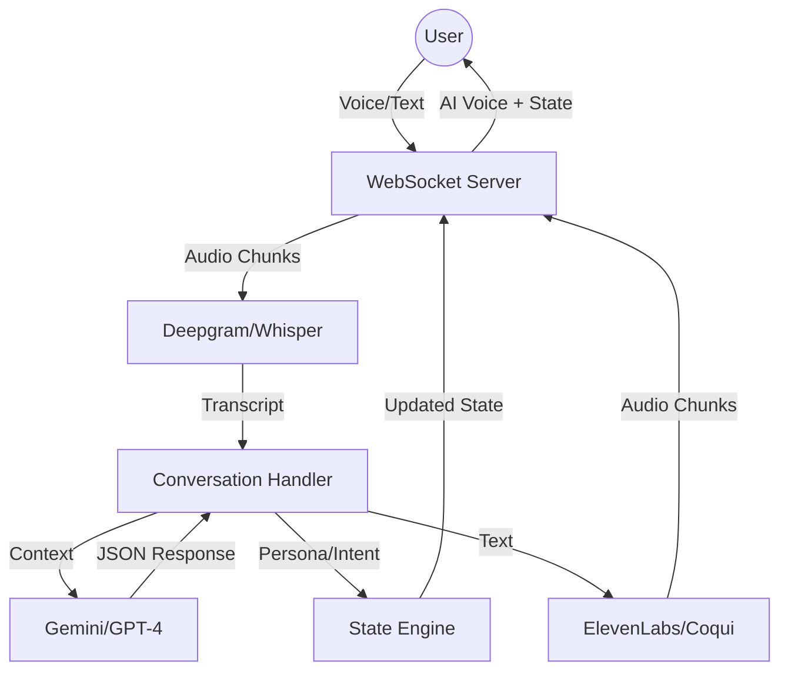

# Pehli Awaaz — Persona-Aware Multimodal Conversational Engine

Pehli Awaaz is a high-performance, real-time multimodal AI conversion engine designed for Bharat users. It combines streaming voice (STT/TTS), dynamic persona classification, intent scoring, and multilingual adaptation into a seamless sales assistant experience.

## Key Features

- **Multimodal Input**: Supports both text and real-time streaming microphone input.
- **Persona Classifier Engine**: Dynamically classifies users into categories like Trader, MFD, Investor, etc., and adapts tone accordingly.
- **Intent + Trust Engine**: Real-time scoring (0-10 for intent, 0-1 for trust) to drive conversation strategy.
- **Multilingual Support**: Handles Hindi, English, and Hinglish (code-mixed) naturally.
- **AI Voice Response**: Human-like TTS (ElevenLabs supported) with replay functionality.
- **Real-time Streaming**: Sub-1.5s latency using WebSockets and token streaming.
- **RM Handoff**: Generates dynamic summaries for human Relationship Managers.

## Technology Stack

- **Backend**: FastAPI, WebSockets, Python 3.10+
- **Frontend**: React (Vite), TailwindCSS, Zustand
- **LLM**: Google Gemini 2.0 Flash / OpenAI GPT-4o
- **Voice**: Deepgram (STT), ElevenLabs (TTS), OpenAI Whisper (Local Fallback)
- **Database**: In-memory (SessionManager) — Swappable for Redis/MongoDB

## Setup Instructions

### Backend

1. Navigate to the `backend` directory.
2. Create a virtual environment: `python -m venv venv`
3. Activate the environment: `source venv/bin/activate` (or `venv\Scripts\activate` on Windows)
4. Install dependencies: `pip install -r requirements.txt`
5. Create a `.env` file based on `.env.example` and add your API keys:
   - `GOOGLE_API_KEY` or `OPENAI_API_KEY`
   - `DEEPGRAM_API_KEY` (optional, for low-latency STT)
   - `ELEVENLABS_API_KEY` (optional, for premium TTS)
6. Run the server: `python run.py`

### Frontend

1. Navigate to the root directory.
2. Install dependencies: `npm install`
3. Run the development server: `npm run dev`

## Deployment

The application is designed to be containerized using Docker.
- Backend: Expose port 8000.
- Frontend: Build using `npm run build` and serve via Nginx or similar.

## Architecture



## RM Handoff Data Structure

```json
{
  "persona": "TRADER",
  "trust_level": "High",
  "intent_score": 8.5,
  "lead_category": "Hot Lead",
  "language_preference": "Hinglish",
  "key_objections": ["price"],
  "suggested_opening_line": "Hi Trader, I saw you were interested in our ROI benefits...",
  "recommended_next_action": "roi_calculator_approach"
}
```
